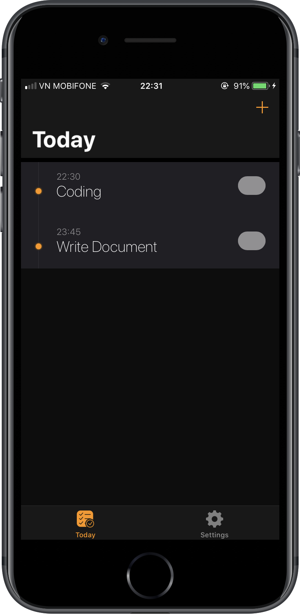

# ios-clean-architecture
[![Build Status][travis-img]][travis-url]

This project contains documents and example of clean architecture of iOS application based on **MVVM-C** and **RxSwift**

- [ios-clean-architecture](#ios-clean-architecture)
  - [MVVM-Coordinator and Clean Architecture](#mvvm-coordinator-and-clean-architecture)
    - [Overview](#overview)
  - [Example](#example)
    - [Prerequisites](#prerequisites)
    - [Installing](#installing)
  - [Contributing](#contributing)
  - [Versioning](#versioning)
  - [Authors](#authors)
  - [License](#license)
  - [Acknowledgments](#acknowledgments)

## MVVM-Coordinator and Clean Architecture

### Overview

![Clean Architecture][image-4]

## Example

The example application will show how I implemented Clean Architecture with MVVM-C

<table>
  <tr>
    <td></td>
    <td></td>
    <td></td>
  </tr>
</table>

### Prerequisites

- Xcode 10+
- Swift 4.2
- Ruby 2.5.1 ([rbenv][rbenv])

```bash
rbenv install 2.5.1
```

- [Bundler][bundler] (manage [cocoapods][cocoapods])

```base
gem install bundler
```

### Installing

After you install `ruby-2.5.1` and `bundler`

Run this command to install `cocoapods`

```base
bundle install
```

Then, install dependencies in this project via **Cocoapods**

```base
bundle exec pod install
```

Now, run your project with Xcode and see the demo app

## Contributing

Contributions are welcome 🎉🎊

When contributing to this repository, please first discuss the change you wish to make via issue before making a change.

You can also opening a PR if you want to fix bugs or improve something.

## Versioning

For the versions available, see the [release on this repository][releases]. 

> We use [SemVer](http://semver.org/) for versioning

## Authors

* [@suho][suho]

See also the list of [contributors][contributors] who participated in this project.

## License

This project is licensed under the MIT License - see the [LICENSE.md][license] file for details

## Acknowledgments

* Thanks to [@sergdort][sergdort] with his example about clean architecture
* [RxSwift][rxswift]

[releases]: https://github.com/suho/ios-clean-architecture/releases
[suho]: https://github.com/suho
[contributors]: https://github.com/suho/ios-clean-architecture/contributors
[license]: ./LICENSE.md
[bundler]: https://bundler.io/
[rbenv]: https://github.com/rbenv/rbenv
[cocoapods]: https://cocoapods.org/
[fastlane]: https://fastlane.tools/
[sergdort]: https://github.com/sergdort
[rxswift]: https://github.com/ReactiveX/RxSwift
[image-1]: ./img/add_task_framed.png
[image-2]: ./img/settings_framed.png
[image-3]: ./img/today_tasks_framed.png
[travis-img]: https://travis-ci.org/suho/ios-clean-architecture.svg?branch=master
[travis-url]: https://travis-ci.org/suho/ios-clean-architecture
[image-4]: ./img/architecture.jpg

