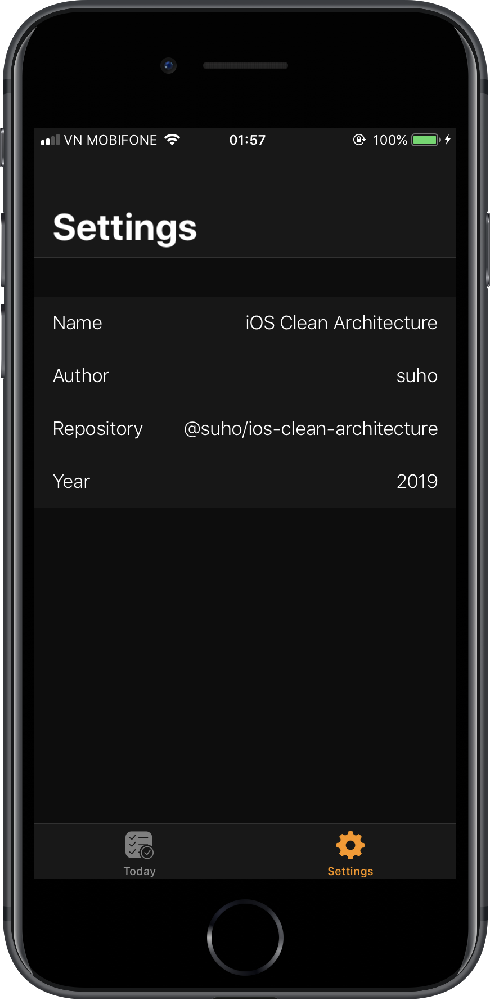
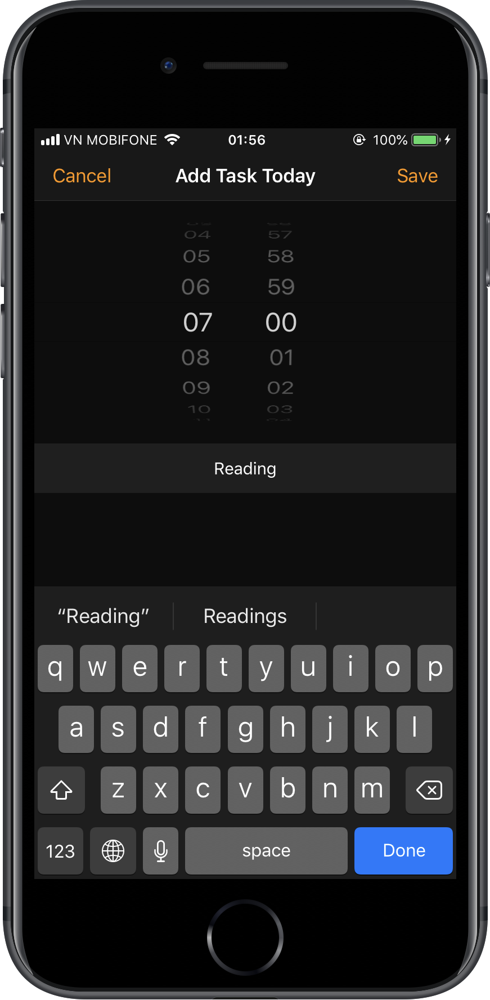

# ios-clean-architecture
[![Build Status][travis-img]][travis-url]

This project contains documents and example of clean architecture of iOS application based on **MVVM-C** and **RxSwift**

**Table of Contents**
- [MVVM-Coordinator and Clean Architecture](#mvvm-coordinator-and-clean-architecture)
  - [Overview](#overview)
  - [Application](#application)
  - [Service](#service)
- [Example](#example)
  - [Prerequisites](#prerequisites)
  - [Installing](#installing)
- [Contributing](#contributing)
- [Versioning](#versioning)
- [Authors](#authors)
- [License](#license)
- [Acknowledgments](#acknowledgments)

## MVVM-Coordinator and Clean Architecture

### Overview

![Clean Architecture][image-4]

### Application

**Application** is responsible for delivering information to the user and handling user input. This application implemented with MVVM-C. This is place for your **View**s, **ViewModel**s, **Model**s and **Coordinator**s.

In the current example, **Application** is implemented with **MVVM-C** and use **RxSwift**.

First of all, **Model** defines `Entity` and `UseCase` of the application.

```swift
final class Task {
    let id: String
    var name: String
    var startAt: Date
    var createdAt: Date
    var updatedAt: Date
    var isFinish: Bool
}
```

```swift
protocol TaskUseCase {
    func add(_ task: Task) -> Observable<Task>
    func update(_ task: Task) -> Observable<Task>
    func today() -> Observable<[Task]>
    func find(by id: String) -> Observable<Task?>
    func delete(_ task: Task) -> Observable<Void>
}
```

`View` contains `ViewModel` and `ViewModel` performs pure transformation of a user `Input` to the `Output`

```swift
protocol View {
    associatedtype ViewModelType: ViewModel
    var viewModel: ViewModelType! { get set }
}

protocol ViewModel {
    associatedtype Input
    associatedtype Output
    associatedtype CoordinatorType: Coordinate

    var coordinator: CoordinatorType? { get set }

    func transform(input: Input) -> Output
}
```

A `Model` (Entity, UseCase) can be injected/initializer into a `ViewModel` and a `ViewModel` also can be injected into a `ViewController` (View) via property injection or initializer. This is done by `Coordinator`.

```swift
protocol Coordinate {
    associatedtype Screen
    associatedtype View: UIViewController

    var viewController: View? { get set }
}
```

`Coordinator` also contains navigation logic for describing which screens are shown in which order.

```swift
// View
final class TodayViewController: ViewController, View {
  var viewModel: TodayViewModel!

  override func bindViewModel() {
        super.bindViewModel()
        // Magic here
    }
}
```

```swift
// ViewModel
final class TodayViewModel: ViewModel {
    struct Input {
        let loadTrigger: Driver<Void>
        let addTrigger: Driver<Void>
        let updateTrigger: Driver<TaskCellViewModel>
        let deleteTrigger: Driver<IndexPath>
    }

    struct Output {
        let taskViewModels: Driver<[TaskCellViewModel]>
        let addTask: Driver<Void>
        let updateTask: Driver<Void>
        let progress: Driver<Float>
        let delete: Driver<Void>
    }

    var coordinator: TodayCoordinator?
    private let useCase: TaskUseCase

    init(useCase: TaskUseCase, coordinator: TodayCoordinator) {
        self.useCase = useCase
        self.coordinator = coordinator
    }

    func transform(input: Input) -> Output {
        // Magic here
    }
}
```

```swift
final class TabBarCoordinator: Coordinate {

    weak var viewController: TabBarController?

    func showScreen(_ screen: TabBarCoordinator.Screen) {}

    private func todayNavi() -> UINavigationController {
        // View
        let controller = TodayViewController()

        // Init UseCase for inject into ViewModel
        let repository = RealmRepository<Task>()
        let useCase = RealmTask(repository: repository)

        // Coordinator
        let coordinator = TodayCoordinator()
        coordinator.viewController = controller

        // ViewModel
        let viewModel = TodayViewModel(useCase: useCase, coordinator: coordinator)
        controller.viewModel = viewModel

        //
        let navigationController = NavigationController(rootViewController: controller)
        navigationController.tabBarItem = UITabBarItem(title: App.String.today,
                                                       image: App.Image.today,
                                                       tag: 0)
        return navigationController
    }

    // Magic here
}
```

### Service

The **Service** is a concrete implementation of **Model** in a specific service. It does hide all implementation details. For example, database implementation whether it is Realm, CoreData, etc.

Sometime, because of framework requirements (e.g. Realm, CoreData), we can't use `Model's Entity` to implement

```swift
final class RTask: Object {
    @objc dynamic var id: String = ""
    @objc dynamic var name: String = ""
    @objc dynamic var startAt: Date = Date()
    @objc dynamic var createdAt: Date = Date()
    @objc dynamic var updatedAt: Date = Date()
    @objc dynamic var isFinish: Bool = false
}
```

The `Service` also contains concrete implementations of `Model's UseCase`, `Repositories` or `Any Services` that are defined in `Model`.

```swift
final class RealmTask<R: Repository>: TaskUseCase where R.Entity == Task {
    private let repository: R

    init(repository: R) {
        self.repository = repository
    }

    func add(_ task: Task) -> Observable<Task> {
        return repository.save(task)
    }

    func update(_ task: Task) -> Observable<Task> {
        return repository.save(task)
    }

    // Another magic here
}
```

After finish implement the `Service`, we will inject `Service`~`UseCase`(Model) into `ViewModel` by `Coordinator`

## Example

The example application will show how I implemented Clean Architecture with MVVM-C
The example application is `Task Todo App` which uses `Realm` and `Network` as a proof of concept that the `Application` is not dependant on the `Service` implementation detail.

<table>
  <tr>
    <td></td>
    <td></td>
    <td></td>
  </tr>
</table>

### Prerequisites

- Xcode 10+
- Swift 4.2
- Ruby 2.5.1 ([rbenv][rbenv])

```bash
rbenv install 2.5.1
```

- [Bundler][bundler] (manage [cocoapods][cocoapods])

```base
gem install bundler
```

### Installing

After you install `ruby-2.5.1` and `bundler`

Run this command to install `cocoapods`

```base
bundle install
```

Then, install dependencies in this project via **Cocoapods**

```base
bundle exec pod install
```

Now, run your project with Xcode and see the demo app

## Contributing

Contributions are welcome 🎉🎊

When contributing to this repository, please first discuss the change you wish to make via issue before making a change.

You can also opening a PR if you want to fix bugs or improve something.

## Versioning

For the versions available, see the [release on this repository][releases]. 

> We use [SemVer](http://semver.org/) for versioning

## Authors

* [@suho][suho]

See also the list of [contributors][contributors] who participated in this project.

## License

This project is licensed under the MIT License - see the [LICENSE.md][license] file for details

## Acknowledgments

* Thanks to [@sergdort][sergdort] with his example about clean architecture
* [RxSwift][rxswift]

[releases]: https://github.com/suho/ios-clean-architecture/releases
[suho]: https://github.com/suho
[contributors]: https://github.com/suho/ios-clean-architecture/contributors
[license]: ./LICENSE.md
[bundler]: https://bundler.io/
[rbenv]: https://github.com/rbenv/rbenv
[cocoapods]: https://cocoapods.org/
[fastlane]: https://fastlane.tools/
[sergdort]: https://github.com/sergdort
[rxswift]: https://github.com/ReactiveX/RxSwift
[image-1]: ./img/ios/add_task_framed.png
[image-2]: ./img/ios/settings_framed.png
[image-3]: ./img/ios/today_tasks_framed.png
[travis-img]: https://travis-ci.org/suho/ios-clean-architecture.svg?branch=master
[travis-url]: https://travis-ci.org/suho/ios-clean-architecture
[image-4]: ./img/draw/architecture.jpg

